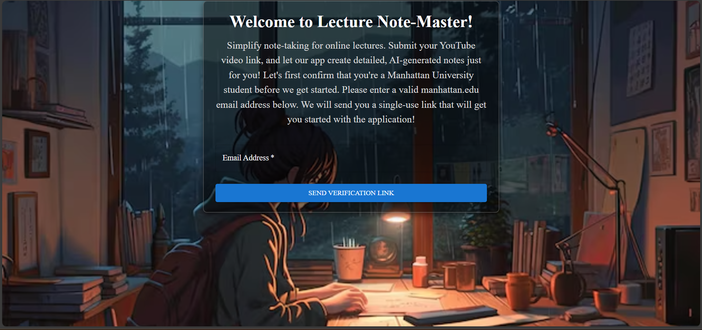
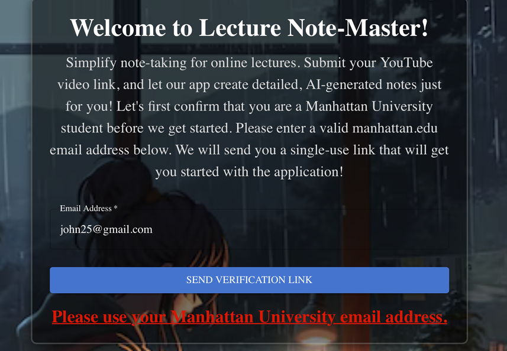
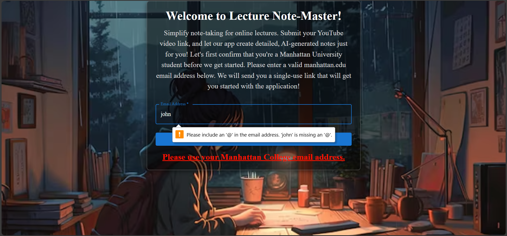
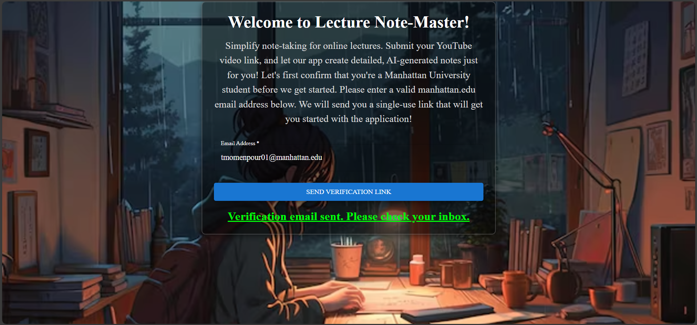
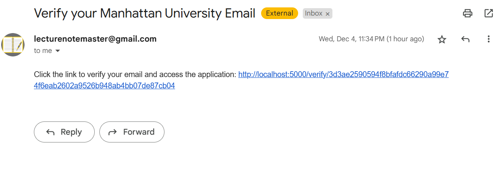
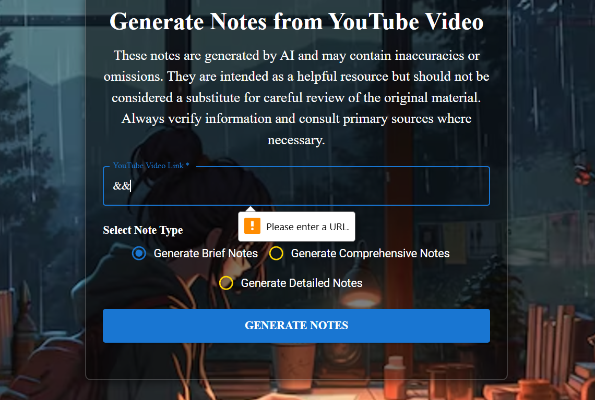
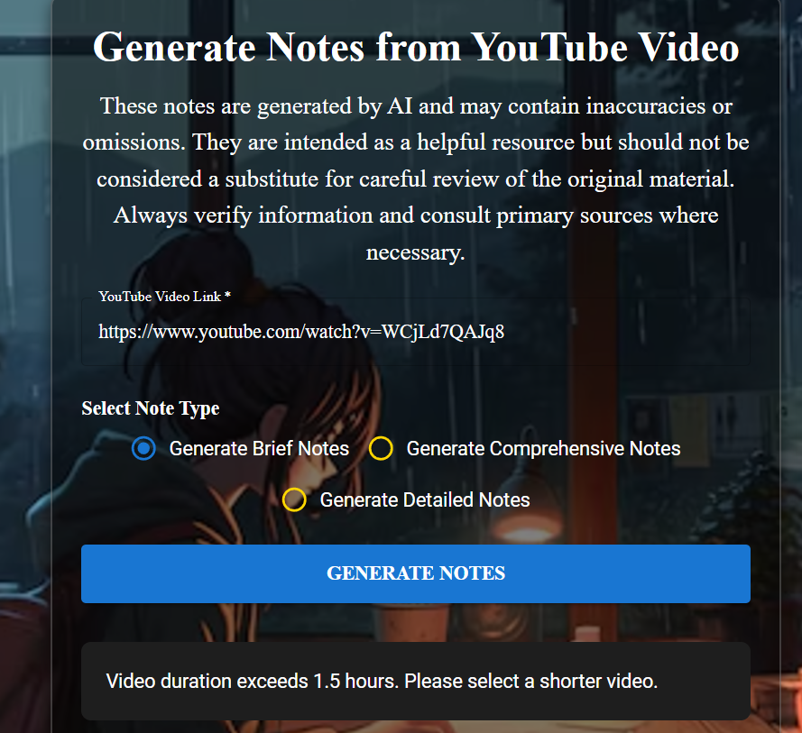
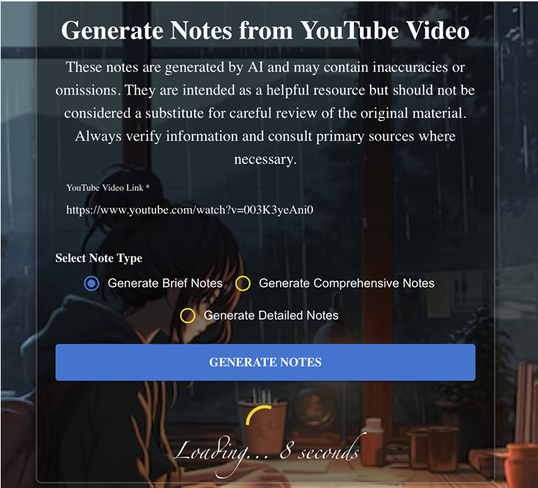
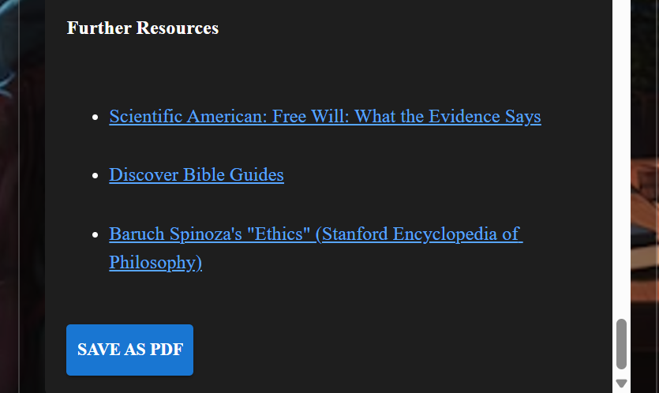
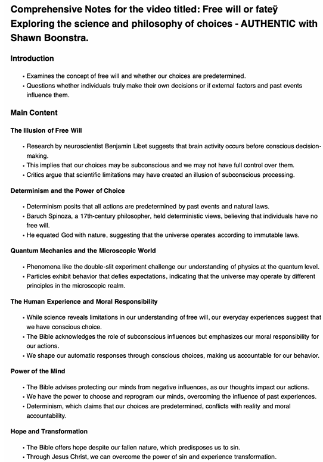

# Lecture NoteMaster

This is the public repository for the Lecture NoteMaster project. This application allows users to generate notes in various formats from YouTube videos.

## Description

Lecture NoteMaster is a web application designed to simplify the process of taking notes from online lectures and videos. Users can provide a YouTube video link, select their desired note-taking style (Brief, Comprehensive, or Detailed), and the application will generate structured, AI-powered notes in Markdown format. The application also includes a feature to save the generated notes as a PDF. For access control, the application uses an email verification system, currently configured for `@manhattan.edu` email addresses.

## Features

* **Email Verification:** Restricts access to users with a `@manhattan.edu` email address.
* **YouTube Video Processing:**
    * Downloads YouTube videos using `yt-dlp`.
    * Transcribes video audio to text using `insanely-fast-whisper`.
    * Refines the transcript for clarity and accuracy using the Gemini Pro API.
* **AI-Powered Note Generation:**
    * Generates notes from the refined transcript based on the user's selected note type (Brief, Comprehensive, or Detailed).
    * Notes are generated in Markdown format.
* **Note Display and Export:**
    * Displays the generated notes in a clean, readable format.
    * Allows users to save the generated notes as a PDF.

## User Interface Overview

Here are some screenshots showcasing the application's user interface and key workflows:

### 1. Welcome and Email Verification

The initial welcome page of Lecture NoteMaster, prompting users to enter their Manhattan University email for access.

<div align="center">
    
    <br>
    <em>Figure 1: Welcome Screen and Email Input.</em>
</div>
<br>

The application provides immediate feedback for invalid email formats, ensuring only authorized users proceed.

<div align="center">
    
    <br>
    <em>Figure 2: Error for non-Manhattan University email address.</em>
</div>
<br>

<div align="center">
    
    <br>
    <em>Figure 3: Error when the '@' symbol is missing from the email address.</em>
</div>
<br>

Upon successful email submission, a verification link is sent to the user's inbox, and a confirmation message is displayed on the application.

<div align="center">
    
    <br>
    <em>Figure 4: Confirmation message after sending verification email.</em>
</div>
<br>

<div align="center">
    
    <br>
    <em>Figure 5: Example of the verification email received in the user's inbox.</em>
</div>
<br>

### 2. Note Generation Page

After successful email verification, users are directed to the note generation page where they can input a YouTube video link and select their desired note type. The application provides clear error messages for invalid video inputs.

<div align="center">
    
    <br>
    <em>Figure 6: Error for an invalid YouTube URL format.</em>
</div>
<br>

<div align="center">
    
    <br>
    <em>Figure 7: Error indicating the video duration exceeds the allowed limit.</em>
</div>
<br>

While the notes are being processed, a loading indicator provides real-time feedback on the generation progress.

<div align="center">
    
    <br>
    <em>Figure 8: Loading screen during note generation.</em>
</div>
<br>

### 3. Generated Notes and Export

Once the notes are generated, they are displayed directly within the application, offering a clean and readable format. Users also have the convenient option to save these notes as a PDF.

<div align="center">
    
    <br>
    <em>Figure 9: Display of comprehensive notes after generation.</em>
</div>
<br>

<div align="center">
    
    <br>
    <em>Figure 10: "Save as PDF" button for exporting generated notes.</em>
</div>
<br>

A sample of how the exported notes appear in PDF format.

<div align="center">
    
    <br>
    <em>Figure 11: First page of the notes saved as a PDF.</em>
</div>
<br>

---

## Tech Stack

### Frontend

* **Framework:** [React.js](https://reactjs.org/)
* **UI Libraries:**
    * [Material-UI](https://mui.com/)
    * [Chakra UI](https://chakra-ui.com/)
* **Routing:** [React Router](https://reactrouter.com/)
* **Markdown Rendering:** [React Markdown](https://github.com/remarkjs/react-markdown)
* **PDF Generation:** [jsPDF](https://github.com/parallax/jsPDF)
* **Testing:**
    * [React Testing Library](https://testing-library.com/docs/react-testing-library/intro/)
    * [Jest DOM](https://github.com/testing-library/jest-dom)

### Backend

* **Framework:** [Express.js](https://expressjs.com/)
* **Email:** [Nodemailer](https://nodemailer.com/) for sending verification emails.
* **Remote Execution:** [node-ssh](https://github.com/steelbrain/node-ssh) to connect to a remote server and run the Python script.

### Core Logic (Python)

* **Video Downloading:** [yt-dlp](https://github.com/yt-dlp/yt-dlp)
* **Transcription:** [insanely-fast-whisper](https://github.com/Vaibhavs10/insanely-fast-whisper)
* **AI Model:** [Google Gemini Pro](https://ai.google/discover/gemini/)

## How It Works

1.  **Email Verification:** A user enters their `@manhattan.edu` email address. A verification link is sent to the provided email.
2.  **Access Application:** Upon clicking the verification link, the user is redirected to the main application page.
3.  **Submit Request:** The user provides a YouTube video link and selects a note type.
4.  **Backend Processing:** The backend receives the request and establishes an SSH connection to a remote server.
5.  **Execute Python Script:** The `process_video.py` script is executed on the remote server with the YouTube link and note type as arguments.
6.  **Note Generation:** The Python script handles downloading the video, transcribing the audio, refining the transcript, and generating the notes.
7.  **Retrieve Notes:** The backend retrieves the generated notes file from the remote server.
8.  **Display and Download:** The notes are sent to the frontend, displayed to the user, and can be downloaded as a PDF.

## Getting Started

### Prerequisites

### Frontend
* Node.js >= 14.0.0
* npm (any modern version)

### Backend
* Node.js >= 10.16.0
* npm (any modern version)

* Python 3
* Access to a server with the required Python dependencies and `insanely-fast-whisper` installed.
* Google API key for Gemini Pro and YouTube Data API.

### Installation

1.  **Clone the repository:**
    ```bash
    git clone [https://github.com/T-9173/publicLectureNoteMaster.git](https://github.com/T-9173/publicLectureNoteMaster.git)
    cd publiclecturenotemaster
    ```
2.  **Install frontend dependencies:**
    ```bash
    npm install
    ```
3.  **Install backend dependencies:**
    ```bash
    cd backend
    npm install
    cd ..
    ```

### Running the Application

1.  **Start the backend server:**
    ```bash
    cd backend
    node server.js
    ```
2.  **Start the frontend development server:**
    ```bash
    npm start
    ```

## Scripts

* `npm start`: Runs the app in development mode.
* `npm test`: Launches the test runner in interactive watch mode.
* `npm run build`: Builds the app for production to the `build` folder.
* `npm run eject`: Ejects the app from Create React App's managed configuration.

## Contributing

Contributions are welcome! Please feel free to submit a pull request.
